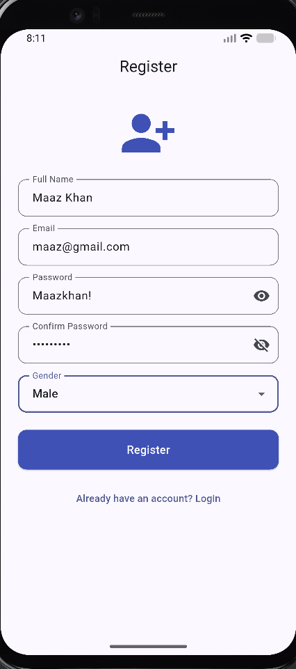
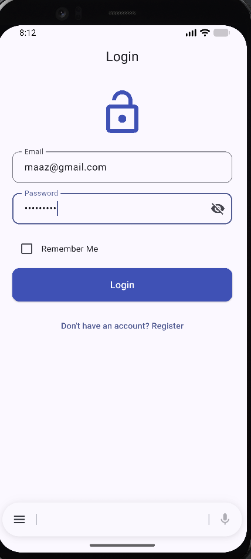
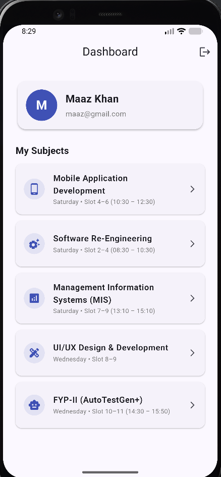
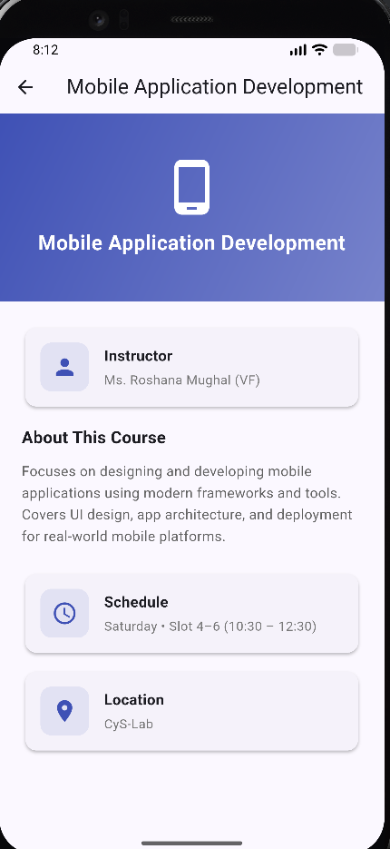
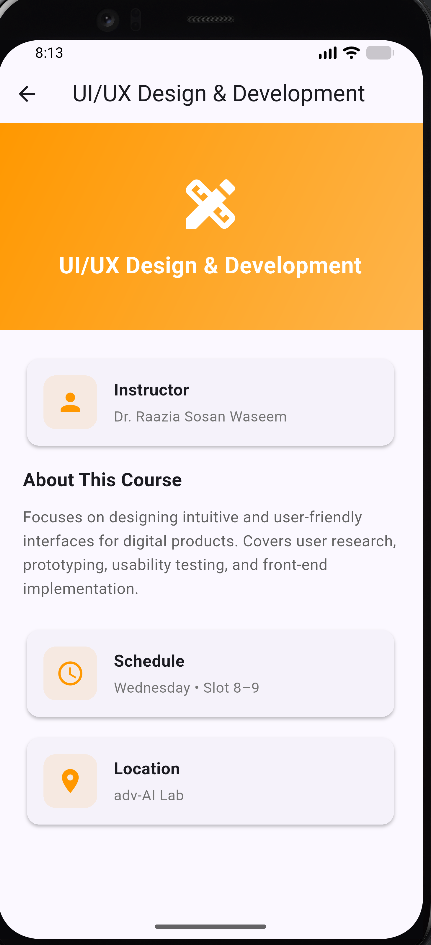
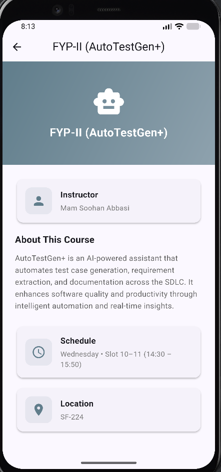

# 📱 Syncora — Flutter Multi-Screen App

## 📘 Overview

A complete **multi-screen Flutter application** featuring **user authentication**, **form validation**, **navigation**, and **full CRUD course management via REST API** — built as a **coding assessment project** demonstrating professional Flutter development skills.

The app implements a full **registration → login → dashboard → detail** flow with **comprehensive input validation**, **separated business logic**, **reusable components**, and **clean architecture** following industry best practices.

In this extension, the app integrates the **JSONPlaceholder REST API** to implement full **CRUD operations** (Create, Read, Update, Delete) for course data — following a clean service-layer architecture that keeps API logic completely separate from UI.

---

💼 This project is part of my **Mobile Application Development** coursework at **DHA Suffa University**, highlighting **Flutter UI development**, **REST API integration**, **state management**, and **multi-screen navigation proficiency**.

---

## 🌐 API Used

**[JSONPlaceholder](https://jsonplaceholder.typicode.com)** — A free fake REST API used for testing and prototyping.

| **Operation** | **HTTP Method** | **Endpoint** |
|---------------|----------------|--------------|
| Fetch Courses | `GET` | `/posts?_limit=10` |
| Add Course | `POST` | `/posts` |
| Update Course | `PUT` | `/posts/{id}` |
| Delete Course | `DELETE` | `/posts/{id}` |

### 📄 Documentation Followed
- Official JSONPlaceholder Guide: [https://jsonplaceholder.typicode.com/guide](https://jsonplaceholder.typicode.com/guide)
- Flutter `http` package: [https://pub.dev/packages/http](https://pub.dev/packages/http)
- Flutter Provider package: [https://pub.dev/packages/provider](https://pub.dev/packages/provider)

> **Note:** JSONPlaceholder is a read-only mock API — POST/PUT/DELETE requests are accepted and return valid responses, but do not persist data on the server. The app reflects changes locally in state.

---

## 🌿 Branch

All CRUD API integration work is on the dedicated branch:

```
feature/course-api-integration
```

---

## 🏗️ Architecture

```
lib/
├── main.dart                        # App entry point (MultiProvider setup)
├── models/
│   ├── user_model.dart              # User data class
│   ├── subject_model.dart           # Subject data class
│   └── course_model.dart            # Course model (maps JSONPlaceholder /posts)
├── services/
│   └── course_service.dart          # API layer — all HTTP calls (GET/POST/PUT/DELETE)
├── enums/
│   └── enums.dart                   # Gender enum with labels
├── utils/
│   └── validators.dart              # Reusable static validator class
├── controllers/
│   ├── auth_controller.dart         # Business logic (auth)
│   └── course_controller.dart       # State management for CRUD (ChangeNotifier)
├── screens/
│   ├── registration_screen.dart     # Registration form + validation
│   ├── login_screen.dart            # Login + remember me
│   ├── dashboard_screen.dart        # User info + subject list + API Courses entry
│   ├── courses_screen.dart          # Full CRUD UI for API courses
│   └── detail_screen.dart           # Subject detail view
└── widgets/
    └── custom_text_field.dart       # Reusable text field component
```

### 🧩 Layer Separation
| **Layer** | **Responsibility** |
|-----------|-------------------|
| **Models** | Type-safe data classes (`UserModel`, `SubjectModel`, `CourseModel`) |
| **Services** | `CourseService` — all HTTP/API calls. Completely separate from UI. |
| **Controllers** | `AuthController` + `CourseController` — business logic & state management |
| **Screens** | One file per screen — pure presentation layer |
| **Widgets** | `CustomTextField` — reusable component, eliminates duplication |

---

## 📸 Screenshots

### 🔐 Authentication Flow
<p align="center">
  
  &nbsp;&nbsp;&nbsp;
  
  &nbsp;&nbsp;&nbsp;
  
</p>
<p align="center">
  <em>Registration Screen → Login Screen → Dashboard Screen</em>
</p>

### 📚 Subject Detail Screens
<p align="center">
  
  &nbsp;&nbsp;&nbsp;
  
  &nbsp;&nbsp;&nbsp;
  
</p>
<p align="center">
  <em>Mobile App Dev → UI/UX Design → FYP-II (AutoTestGen+)</em>
</p>

---

## ⚙️ Features Implemented

### Original Features
| **Screen** | **Key Features** |
|------------|-----------------| 
| **Registration** | Full Name, Email, Password, Confirm Password, Gender dropdown with real-time validation |
| **Login** | Email/Password authentication, show/hide password toggle, Remember Me checkbox |
| **Dashboard** | User profile card with avatar, dynamic subject list, tap navigation, logout with confirmation |
| **Detail** | Subject header with gradient banner, instructor info, course description, schedule, location |

### 🆕 CRUD API Extension
| **Feature** | **Details** |
|-------------|------------|
| **Fetch Courses (GET)** | Retrieves 10 courses from JSONPlaceholder `/posts`. Shows loading indicator while fetching. Handles error states with retry button. |
| **Add Course (POST)** | FAB → dialog form with title + description. Validates inputs. POSTs to API. Prepends new course to list on success. |
| **Update Course (PUT)** | Edit button on each card → pre-filled form dialog. PUTs update to API. Reflects changes in UI immediately. |
| **Delete Course (DELETE)** | Delete button → confirmation dialog. DELETEs from API. Removes item from list after successful response. |

---

## 🔒 Validation Rules

| **Field** | **Rules** |
|-----------|----------|
| **Full Name** | Required, minimum 2 characters |
| **Email** | Required, valid email format (regex validated) |
| **Password** | Minimum 6 characters, at least 1 uppercase letter, at least 1 special character |
| **Confirm Password** | Required, must match password field |
| **Gender** | Required dropdown selection |
| **Course Title** | Required (CRUD form) |
| **Course Description** | Required (CRUD form) |

---

## 🗺️ Navigation Flow

```
Registration ──pushReplacement──► Login ──pushReplacement──► Dashboard ──push──► Detail
                   ↑                           ↑                    │
                   │                           └── Logout ◄──────────┘
                   └──────────── Toggle ─────────────┘
                                                      │
                                                      └──push──► Courses (API CRUD)
```

---

## 📚 Enrolled Subjects

| **Subject** | **Instructor** | **Day** | **Timing** | **Location** |
|-------------|---------------|---------|-----------|-------------|
| Mobile Application Development | Ms. Roshana Mughal (VF) | Saturday | Slot 4–6 (10:30 – 12:30) | CyS-Lab |
| Software Re-Engineering | Mr. Conrad D'Silva / Ms. Naureen Anwar (VF) | Saturday | Slot 2–4 (08:30 – 10:30) | SF-239 |
| Management Information Systems (MIS) | Mr. Muhammad Ahmed Qaiser (VF) | Saturday | Slot 7–9 (13:10 – 15:10) | SF-240 |
| UI/UX Design & Development | Dr. Raazia Sosan Waseem | Wednesday | Slot 8–9 | adv-AI Lab |
| FYP-II (AutoTestGen+) | Mam Soohan Abbasi | Wednesday | Slot 10–11 (14:30 – 15:50) | SF-224 |

---

## 🧠 Technical Highlights

🔸 **Service Layer Architecture — API Logic Separation**
*Approach:* `CourseService` class handles all HTTP operations. Controllers call service methods. UI only observes state.
*Benefit:* Clean, testable, reusable API layer — no HTTP code in UI files.

🔸 **ChangeNotifier State Management**
*Approach:* `CourseController extends ChangeNotifier` manages `isLoading`, `errorMessage`, and `courses` list.
*Benefit:* UI reacts automatically to state changes via `Consumer<CourseController>`.

🔸 **Custom Validator Class — Separation of Concerns**
*Approach:* All validation logic in a single static class with private constructor.
*Benefit:* Reusable across screens, easy to unit test, zero UI coupling.

🔸 **Enum Implementation — Type-Safe Categorical Data**
*Approach:* `Gender` enum with `label` getter for display text.
*Benefit:* Prevents invalid values, eliminates hardcoded strings.

🔸 **Proper Error & Loading State Handling**
*Approach:* Every API call transitions through loading → success/error states.
*Benefit:* Users always know what's happening — spinner while loading, error with retry on failure.

---

## 💡 Key Learnings & Skills Demonstrated

| **Area** | **Skills Gained** |
|----------|-------------------|
| **REST API Integration** | GET, POST, PUT, DELETE with `http` package, JSON parsing |
| **State Management** | `ChangeNotifier` + `Provider` pattern |
| **Architecture** | Strict service/controller/UI separation |
| **Flutter UI Development** | Multi-screen layouts, Material Design 3, responsive forms |
| **Form Validation** | Real-time validation, custom validators, regex |
| **Navigation** | Push/pushReplacement strategies |
| **UX Best Practices** | Loading indicators, confirmation dialogs, snackbar feedback, pull-to-refresh |

---

## 🧰 Tools & Technologies

| **Category** | **Tools / Technologies** |
|--------------|--------------------------|
| **Framework** | Flutter 3.x |
| **Language** | Dart |
| **API** | JSONPlaceholder (https://jsonplaceholder.typicode.com) |
| **Packages** | `http ^1.2.1`, `provider ^6.1.2`, `cupertino_icons` |
| **Design System** | Material Design 3 |
| **IDE** | VS Code / Android Studio |
| **Emulator** | Android Emulator (API 37) |
| **Version Control** | Git / GitHub |
| **Branch** | `feature/course-api-integration` |

---

## 🚀 How to Run

1. **Ensure Flutter SDK is installed:**
   ```bash
   flutter --version
   ```

2. **Clone the repository:**
   ```bash
   git clone <your-repo-url>
   cd flutter-multi-screen-app-main
   git checkout feature/course-api-integration
   ```

3. **Install dependencies:**
   ```bash
   flutter pub get
   ```

4. **Run on emulator or device:**
   ```bash
   flutter run
   ```

5. **Run on Chrome (web):**
   ```bash
   flutter run -d chrome
   ```

---

## 🎯 Assessment Checklist

### Original Requirements
| **Requirement** | **Status** |
|-----------------| -----------|
| Registration with all fields | ✅ Complete |
| Email validation | ✅ Regex validated |
| Password rules (6 chars, uppercase, special) | ✅ Complete |
| Confirm password matching | ✅ Complete |
| Gender dropdown with enum | ✅ Enum implemented |
| Login with email/password | ✅ Complete |
| Show/hide password toggle | ✅ Eye icon |
| Remember Me checkbox | ✅ Complete |
| Dashboard with user info + avatar | ✅ Complete |
| Subject list with tap navigation | ✅ 5 subjects |
| Logout → back to login | ✅ With confirmation |
| Detail screen (header, banner, description, schedule) | ✅ Complete |
| Custom Validator Class | ✅ Separated |
| Enum Implementation | ✅ Gender enum |
| Controller Layer | ✅ AuthController |
| Clean folder structure | ✅ MVC-like |
| Runs without errors | ✅ Verified |

### 🆕 CRUD API Extension Requirements
| **Requirement** | **Status** |
|-----------------|-----------|
| Fetch course list from API (GET) | ✅ Complete |
| Display title, ID, and description | ✅ Complete |
| Show loading indicator while fetching | ✅ Complete |
| Handle error states properly | ✅ Retry button on error |
| Add new course using API (POST) | ✅ Complete |
| Update UI after successful POST | ✅ Prepended to list |
| Edit existing course details (PUT) | ✅ Complete |
| Pre-fill existing data in form | ✅ Complete |
| Send update request to API | ✅ Complete |
| Reflect changes in UI | ✅ Complete |
| Delete option for each course | ✅ Complete |
| Show confirmation before deletion | ✅ Dialog shown |
| Remove item after successful DELETE | ✅ Complete |
| Separate service layer for API calls | ✅ `CourseService` |
| API logic separate from UI | ✅ Controller + Service |
| Clean and reusable code structure | ✅ Complete |
| Handle loading, success, error states | ✅ Complete |
| Branch: `feature/course-api-integration` | ✅ Created |
| README includes API used | ✅ JSONPlaceholder |
| README includes documentation reference | ✅ Links included |
| README includes branch name | ✅ Listed above |

---

## 🏁 Summary

This project consolidates a complete **multi-screen Flutter application** with **full REST API CRUD integration** — demonstrating **professional development practices** from **architecture design** to **form validation** to **API state management**.

It validates expertise in **Flutter UI development**, **Dart programming**, **REST API integration**, **state management with Provider**, **clean architecture**, and **input validation** following modern mobile development standards.

📚 Built with a focus on **code quality**, **reusability**, and **professional architecture** — ready for live demonstration and code review.
