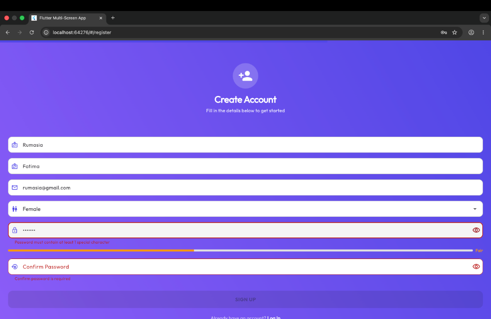
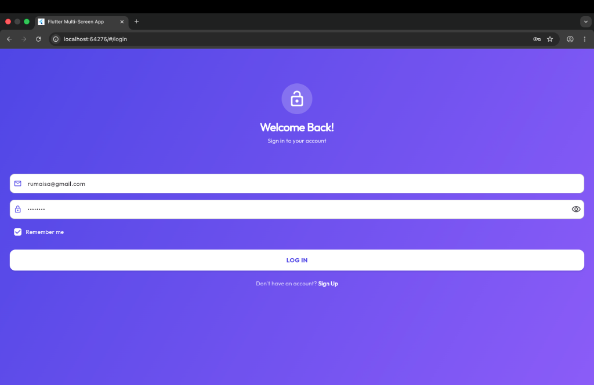
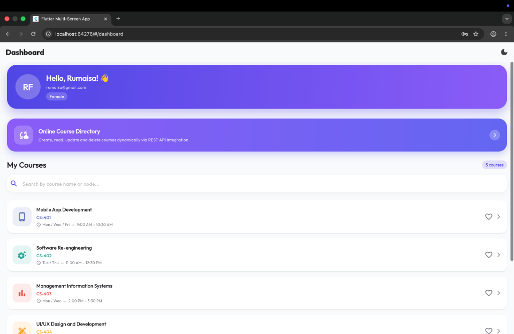
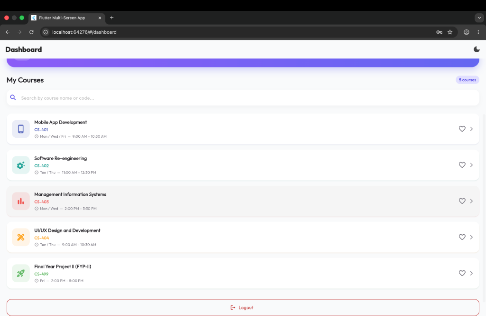
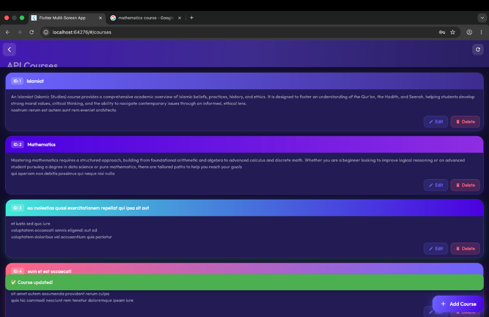
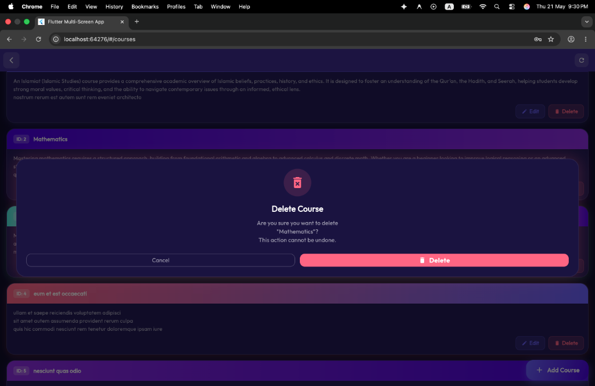
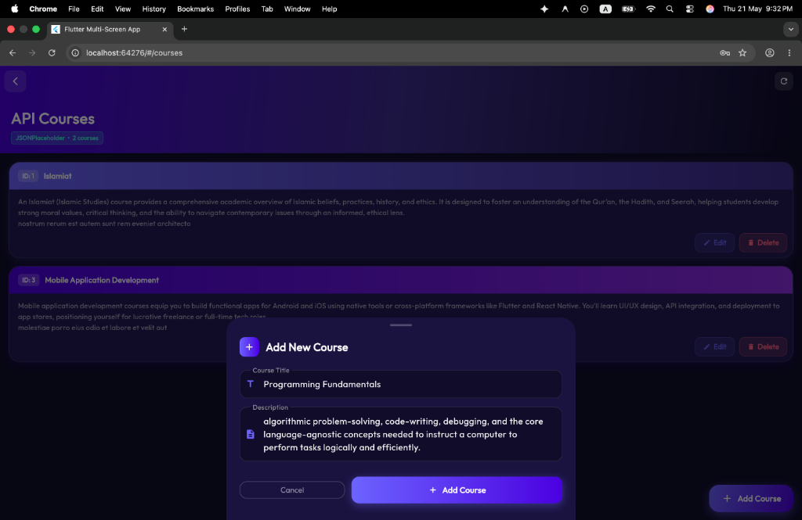

# 📱 Syncora — Flutter Multi-Screen App

## 📘 Overview

A complete **multi-screen Flutter application** featuring **user authentication**, **form validation**, **navigation**, and **full CRUD course management via REST API** — built as a **coding assessment project** demonstrating professional Flutter development skills.

The app implements a full **registration → login → dashboard → detail** flow with **comprehensive input validation**, **separated business logic**, **reusable components**, and **clean architecture** following industry best practices.

In this extension, the app integrates the **JSONPlaceholder REST API** to implement full **CRUD operations** (Create, Read, Update, Delete) for course data — following a clean service-layer architecture that keeps API logic completely separate from UI.

---

### 👤 Student Details
- **Name:** Rumaisa Fatima
- **University:** DHA Suffa University
- **Course:** Mobile Application Development

---

💼 This project is part of my **Mobile Application Development** coursework at **DHA Suffa University**, highlighting **Flutter UI development**, **REST API integration**, **state management**, and **multi-screen navigation proficiency**.

---

## 📸 Screenshots

Here is the complete visual flow of the application, representing the high-fidelity premium user interface, clean gradients, and responsive dialog flows.

### 🔐 Authentication Flow
| **1. Create Account (Registration)** | **2. Welcome Back (Login)** |
|:---:|:---:|
|  |  |
| Includes real-time progressive completion indicator, active password strength feedback, and dropdown constraints. | Features Remember Me checkbox with automatic local session caching and toggleable password visibility. |

### 📊 Dashboard & Navigation
| **3. Main Dashboard Overview** | **4. Dashboard Navigation & Session** |
|:---:|:---:|
|  |  |
| Showcases premium personalized violet header card, interactive quick-action banner, search filter, and course list. | Illustrates the bottom view of scrollable course cards and the unified logout triggers. |

### 🌐 Courses API Integration (CRUD Operations)
| **5. Live API Course List** | **6. Interactive Delete Confirmation** |
|:---:|:---:|
|  |  |
| Renders courses fetched dynamically from JSONPlaceholder API, with success alerts, and CRUD controllers. | Displays the custom blur glassmorphism overlay dialog prompting for confirmation before REST deletion. |

| **7. Add New Course Form** |
|:---:|
|  |
| Features a custom animated bottom sheet with comprehensive input text forms to create mock POST items. |

> [!NOTE]
> **Universal UI Fidelity (Emulator & Desktop Web)**
> 
> The application UI is built using responsive Material Design 3 guidelines. While these screenshots are captured on a **Desktop Web Browser** and the **Android Emulator** for pristine clarity, the codebase runs **identically and flawlessly on any Android/iOS physical device**. The exact same widgets, layouts, gradients, and overlays render perfectly across all screen sizes.

---

## 🌐 API Used

**[JSONPlaceholder](https://jsonplaceholder.typicode.com)** — A free fake REST API used for testing and prototyping.

| **Operation** | **HTTP Method** | **Endpoint** |
|---------------|----------------|--------------|
| Fetch Courses | `GET` | `/posts?_limit=10` |
| Add Course | `POST` | `/posts` |
| Update Course | `PUT` | `/posts/{id}` |
| Delete Course | `DELETE` | `/posts/{id}` |

### 📄 Documentation Followed
- Official JSONPlaceholder Guide: [https://jsonplaceholder.typicode.com/guide](https://jsonplaceholder.typicode.com/guide)
- Flutter `http` package: [https://pub.dev/packages/http](https://pub.dev/packages/http)
- Flutter Provider package: [https://pub.dev/packages/provider](https://pub.dev/packages/provider)

> **Note:** JSONPlaceholder is a read-only mock API — POST/PUT/DELETE requests are accepted and return valid responses, but do not persist data on the server. The app reflects changes locally in state.

---

## 🌿 Branch

All CRUD API integration work is on the dedicated branch:

```
feature/course-api-integration
```

---

## 🏗️ Architecture

```
lib/
├── main.dart                        # App entry point (MultiProvider setup)
├── models/
│   ├── user_model.dart              # User data class
│   ├── subject_model.dart           # Subject data class
│   └── course_model.dart            # Course model (maps JSONPlaceholder /posts)
├── services/
│   └── course_service.dart          # API layer — all HTTP calls (GET/POST/PUT/DELETE)
├── enums/
│   └── app_enums.dart               # Gender, AuthState, Subject enums
├── validators/
│   └── app_validators.dart          # Reusable static validator class
├── controllers/
│   ├── auth_controller.dart         # Business logic (auth)
│   └── course_controller.dart       # State management for CRUD (ChangeNotifier)
├── screens/
│   ├── register_screen.dart         # Registration form + validation
│   ├── login_screen.dart            # Login + remember me
│   ├── dashboard_screen.dart        # User info + subject list + API Courses entry
│   ├── courses_screen.dart          # Full CRUD UI for API courses
│   └── detail_screen.dart           # Subject detail view
└── widgets/
    └── custom_text_field.dart       # Reusable text field component
```

### 🧩 Layer Separation
| **Layer** | **Responsibility** |
|-----------|-------------------|
| **Models** | Type-safe data classes (`UserModel`, `SubjectModel`, `CourseModel`) |
| **Services** | `CourseService` — all HTTP/API calls. Completely separate from UI. |
| **Controllers** | `AuthController` + `CourseController` — business logic & state management |
| **Screens** | One file per screen — pure presentation layer |
| **Widgets** | `CustomTextField` — reusable component, eliminates duplication |

---

## ⚙️ Features Implemented

### Original Features
| **Screen** | **Key Features** |
|------------|-----------------| 
| **Registration** | First Name, Last Name, Email, Password, Confirm Password, Gender dropdown with real-time validation |
| **Login** | Email/Password authentication, show/hide password toggle, Remember Me checkbox |
| **Dashboard** | User profile card with avatar, dynamic subject list, tap navigation, logout with confirmation |
| **Detail** | Subject header with gradient banner, instructor info, course description, schedule, location |

### 🆕 CRUD API Extension
| **Feature** | **Details** |
|-------------|------------|
| **Fetch Courses (GET)** | Retrieves 10 courses from JSONPlaceholder `/posts`. Shows loading indicator while fetching. Handles error states with retry button. |
| **Add Course (POST)** | FAB → dialog form with title + description. Validates inputs. POSTs to API. Prepends new course to list on success. |
| **Update Course (PUT)** | Edit button on each card → pre-filled form dialog. PUTs update to API. Reflects changes in UI immediately. |
| **Delete Course (DELETE)** | Delete button → confirmation dialog. DELETEs from API. Removes item from list after successful response. |

---

## 🔒 Validation Rules

| **Field** | **Rules** |
|-----------|----------|
| **First Name** | Required, minimum 2 characters, letters only |
| **Last Name** | Required, minimum 2 characters, letters only |
| **Email** | Required, valid email format (regex validated) |
| **Password** | Minimum 6 characters, at least 1 uppercase letter, at least 1 special character |
| **Confirm Password** | Required, must match password field |
| **Gender** | Required dropdown selection |
| **Course Title** | Required (CRUD form) |
| **Course Description** | Required (CRUD form) |

---

## 🗺️ Navigation Flow

```
Registration ──pushReplacement──► Login ──pushReplacement──► Dashboard ──push──► Detail
                   ↑                           ↑                    │
                   │                           └── Logout ◄──────────┘
                   └──────────── Toggle ─────────────┘
                                                      │
                                                      └──push──► Courses (API CRUD)
```

---

## 📄 File-by-File Breakdown

---

### `lib/main.dart` — App Entry Point

**What it does:**
- Initializes `AuthController` **before** the UI launches using `WidgetsFlutterBinding.ensureInitialized()`
- Reads `SharedPreferences` on startup to restore saved sessions (Remember Me)
- Wraps the entire app in `ChangeNotifierProvider` so every widget tree can access auth state
- Defines all named routes: `/`, `/login`, `/register`, `/dashboard`, `/detail`
- Contains a **route guard** that blocks unauthorized users from accessing `/dashboard` or `/detail` without logging in — redirecting them to `/login`
- Defines both **Light Theme** and **Dark Theme** using `ColorScheme.fromSeed()` with custom indigo/violet color palette

**Key logic:**
```dart
// Route guard — prevents unauthenticated access
onGenerateRoute: (settings) {
  if (settings.name == '/dashboard' || settings.name == '/detail') {
    if (!isAuthenticated) {
      return MaterialPageRoute(builder: (_) => const LoginScreen());
    }
  }
  return null;
},
```

---

### `lib/enums/app_enums.dart` — Data Constraints

**What it does:**
Defines three enums that replace error-prone raw strings throughout the app.

#### `Gender` enum
```dart
enum Gender {
  male('Male'),
  female('Female'),
  other('Other'),
  preferNotToSay('Prefer not to say');
  final String label;
}
```
Used in the registration dropdown and stored/retrieved from `SharedPreferences`.

#### `AuthState` enum
```dart
enum AuthState { idle, loading, success, error }
```
Drives the `AuthController` state machine. The UI listens to this to show loading spinners or error messages.

#### `Subject` enum
The most complex enum — each Subject carries 7 typed fields:
```dart
enum Subject {
  mobileAppDevelopment(
    name: 'Mobile App Development',
    code: 'CS-401',
    schedule: 'Mon / Wed / Fri  —  9:00 AM – 10:30 AM',
    room: 'CYS Lab',
    instructor: 'Mam Rooshana Mughal',
    email: 'rooshana.mughal@gmail.com',
    credits: 3,
  ),
  // ... 4 more subjects
}
```

**Subjects included:**
| Code | Name | Instructor | Room |
|---|---|---|---|
| CS-401 | Mobile App Development | Mam Rooshana Mughal | CYS Lab |
| CS-402 | Software Re-engineering | Sir Conrad 'D Silva / Mam Noureen Anwar | Room 201 |
| CS-403 | Management Information Systems | Ahmed Qaiser | SF-240 |
| CS-404 | UI/UX Design and Development | Mam Raazia Sosan | ADV-Ai Lab |
| CS-499 | Final Year Project II | Sir Kamran Khan | Project Lab |

---

### `lib/models/user_model.dart` — User Data Class

**What it does:**
A clean, immutable data model representing a logged-in user.

```dart
class UserModel {
  final String firstName;
  final String lastName;
  final String email;
  final Gender gender;
}
```

**Computed properties:**
- `fullName` — returns `'$firstName $lastName'.trim()`
- `initials` — extracts first letters of first + last name (e.g., "RF") for the avatar display

**Serialization:**
- `toMap()` → converts to `Map<String, dynamic>` for storage
- `fromMap()` → rebuilds a `UserModel` from stored data (used on app restart)

---

### `lib/validators/app_validators.dart` — Validation Logic

**What it does:**
A pure static class with zero UI dependencies. All validation logic lives here and is reused across both the login and registration screens.

```dart
class AppValidators {
  AppValidators._(); // Private constructor — prevents instantiation

  static String? required(String? value, {String fieldName = 'This field'})
  static String? firstName(String? value)
  static String? lastName(String? value)
  static String? email(String? value)
  static String? password(String? value)
  static String? confirmPassword(String? value, String originalPassword)
  static String? gender(String? value)
}
```

**Password validation rules:**
```dart
if (pw.length < 6)           → "Password must be at least 6 characters"
if (!RegExp(r'[A-Z]')...)    → "Must contain at least 1 uppercase letter"
if (!RegExp(r'[!@#$...]')...) → "Must contain at least 1 special character"
```

**Email validation regex:**
```
^[a-zA-Z0-9._%+\-]+@[a-zA-Z0-9.\-]+\.[a-zA-Z]{2,}$
```
This ensures `you@example.com` passes but `user@` or `@domain` fails.

---

### `lib/controllers/auth_controller.dart` — Business Logic

**What it does:**
The core controller extending `ChangeNotifier`. It is the **only** part of the app that reads/writes to `SharedPreferences`. The UI never directly touches storage.

**State it manages:**
```dart
AuthState _state         // idle | loading | success | error
UserModel? _currentUser  // null if logged out
bool _rememberMe         // persisted across restarts
bool _isDarkMode         // global theme toggle
List<String> _bookmarkedCourses  // bookmarked subject codes
List<String> _enrolledCourses    // enrolled subject codes
```

**Key methods:**

| Method | Description |
|---|---|
| `init()` | Called at app launch — restores session from SharedPreferences |
| `register()` | Saves new user (with firstName and lastName) to SharedPreferences |
| `login()` | Validates credentials, creates `UserModel`, persists session |
| `logout()` | Clears `_currentUser`, wipes session data |
| `toggleDarkMode()` | Flips theme, persists preference |
| `toggleBookmark()` | Adds/removes from bookmark list, persists |

**Remember Me logic:**
```dart
if (rememberMe) {
  await prefs.setString(_keyLoggedInEmail, normalised);
}
// On next app launch, init() reads this and auto-logs in
```

---

### `lib/widgets/custom_text_field.dart` — Reusable Input Widget

**What it does:**
A single reusable widget that replaces hundreds of lines of repeated `TextFormField` code. Every text input in the app (email, password, name) uses this component.

**Parameters:**
```dart
CustomTextField({
  required TextEditingController controller,
  required String label,
  required String hint,
  required IconData prefixIcon,
  String? Function(String?)? validator,
  bool obscureText = false,
  TextInputType keyboardType,
  Widget? suffixIcon,
  FocusNode? focusNode,
  FocusNode? nextFocusNode,  // Auto-advances focus on submit
})
```

**Behaviour:**
- `floatingLabelBehavior: FloatingLabelBehavior.never` — keeps the label inside the box at all times
- `autovalidateMode: AutovalidateMode.onUserInteraction` — shows errors as user types, not just on submit
- Auto-focus advancement: when the user presses "next" on the keyboard, focus jumps to the next field

---

### `lib/screens/splash_screen.dart` — Entry Animation

**What it does:**
- Shows an animated logo for ~2.8 seconds
- Checks `AuthController.isAuthenticated`
- If logged in → navigates to `/dashboard`
- If not → navigates to `/login`

---

### `lib/screens/login_screen.dart` — Login Screen

**What it does:**
- Full immersive purple gradient background (`LinearGradient` from `colorScheme.primary` to `colorScheme.tertiary`)
- `Form` with `GlobalKey<FormState>` for validation control
- Shows/hides password with `_showPassword` boolean state
- "Remember Me" checkbox wired to `AuthController.login(rememberMe: _rememberMe)`
- On success → `Navigator.pushReplacementNamed(context, '/dashboard')`
- On failure → `SnackBar` with error message from controller

---

### `lib/screens/register_screen.dart` — Registration Screen

**What it does:**
- Same immersive gradient background as Login
- `LinearProgressIndicator` at the top that fills as the user completes each field (calculated from `_formProgress` which evaluates each validator in real-time)
- Gender selection via `DropdownButtonFormField<Gender>`
- Separate **First Name** and **Last Name** text fields with real-time validation feedback.
- On success → navigates to `/login` after showing a success SnackBar.

---

### `lib/screens/dashboard_screen.dart` — Course Dashboard

**What it does:**
- Displays the logged-in user's name, email, and gender in a gradient profile card
- Lists all subjects from `Subject.values` as interactive cards
- **Search bar** filters courses in real-time using `.where()` on the enum list
- **Skeleton loader** animates for 1.5 seconds on load (mimics real API call)
- **Pull-to-refresh** re-triggers the fake loading animation with haptic feedback
- **Bookmark toggle** on each card persists to `SharedPreferences`
- **Logout button** at the bottom opens a confirmation `AlertDialog` before clearing session

**Navigation to detail:**
```dart
Navigator.pushNamed(
  context,
  '/detail',
  arguments: {'subject': subject, 'color': color},
);
```

---

### `lib/screens/detail_screen.dart` — Course Detail Dashboard

**What it does:**
The most complex screen. Receives the subject via route arguments and renders a fully interactive course dashboard with 4 tabs.

#### Tabs:
| Tab | Content |
|---|---|
| **Overview** | About the course → Performance Analytics → Course Progress |
| **Assignments** | Course-specific assignment list with due dates; auto-marks overdue |
| **Schedule** | Live countdown timer to next class session |
| **Instructor** | Teacher name, room, email contact |

#### Live Countdown Timer Logic:
```dart
// Parses schedule string: "Mon / Wed / Fri — 9:00 AM – 10:30 AM"
// 1. Extracts day abbreviations → converts to weekday integers (Mon=1, Tue=2...)
// 2. Finds the nearest upcoming class day from DateTime.now().weekday
// 3. Calculates exact Duration until that class starts
// 4. Displays: "3d 4h" for long durations, "2h 15m 30s" for same-day
```

#### Assignment Auto-Status Logic:
```dart
// Each assignment has a DateTime dueDate
// If DateTime.now().isAfter(assignment.dueDate) → renders with strikethrough + green checkmark
// Otherwise → renders as pending
```

---

## 📚 Enrolled Subjects

| **Subject** | **Instructor** | **Schedule** | **Location** |
|-------------|---------------|--------------|--------------|
| Mobile App Development | Mam Rooshana Mughal | Mon / Wed / Fri  —  9:00 AM – 10:30 AM | CYS Lab |
| Software Re-engineering | Sir Conrad 'D Silva / Mam Noureen Anwar | Tue / Thu  —  11:00 AM – 12:30 PM | Room 201 – Block A |
| Management Information Systems | Ahmed Qaiser | Mon / Wed  —  2:00 PM – 3:30 PM | SF-240 |
| UI/UX Design and Development | Mam Raazia Sosan | Tue / Thu  —  9:00 AM – 10:30 AM | ADV-Ai Lab |
| Final Year Project II (FYP-II) | Sir Kamran Khan | Fri  —  2:00 PM – 5:00 PM | Project Lab – Block D |

---

## 🧠 Technical Highlights

🔸 **Service Layer Architecture — API Logic Separation**
*Approach:* `CourseService` class handles all HTTP operations. Controllers call service methods. UI only observes state.
*Benefit:* Clean, testable, reusable API layer — no HTTP code in UI files.

🔸 **ChangeNotifier State Management**
*Approach:* `CourseController extends ChangeNotifier` manages `isLoading`, `errorMessage`, and `courses` list.
*Benefit:* UI reacts automatically to state changes via `Consumer<CourseController>`.

🔸 **Custom Validator Class — Separation of Concerns**
*Approach:* All validation logic in a single static class with private constructor.
*Benefit:* Reusable across screens, easy to unit test, zero UI coupling.

🔸 **Enum Implementation — Type-Safe Categorical Data**
*Approach:* `Gender` enum with `label` getter for display text.
*Benefit:* Prevents invalid values, eliminates hardcoded strings.

🔸 **Proper Error & Loading State Handling**
*Approach:* Every API call transitions through loading → success/error states.
*Benefit:* Users always know what's happening — spinner while loading, error with retry on failure.

---

## 💡 Key Learnings & Skills Demonstrated

| **Area** | **Skills Gained** |
|----------|-------------------|
| **REST API Integration** | GET, POST, PUT, DELETE with `http` package, JSON parsing |
| **State Management** | `ChangeNotifier` + `Provider` pattern |
| **Architecture** | Strict service/controller/UI separation |
| **Flutter UI Development** | Multi-screen layouts, Material Design 3, responsive forms |
| **Form Validation** | Real-time validation, custom validators, regex |
| **Navigation** | Push/pushReplacement strategies |
| **UX Best Practices** | Loading indicators, confirmation dialogs, snackbar feedback, pull-to-refresh |

---

## 🧰 Tools & Technologies

| **Category** | **Tools / Technologies** |
|--------------|--------------------------|
| **Framework** | Flutter 3.x |
| **Language** | Dart |
| **API** | JSONPlaceholder (https://jsonplaceholder.typicode.com) |
| **Packages** | `http ^1.2.1`, `provider ^6.1.2`, `cupertino_icons` |
| **Design System** | Material Design 3 |
| **IDE** | VS Code / Android Studio |
| **Emulator** | Android Emulator (API 37) |
| **Version Control** | Git / GitHub |
| **Branch** | `feature/course-api-integration` |

---

## 🚀 How to Run

1. **Ensure Flutter SDK is installed:**
   ```bash
   flutter --version
   ```

2. **Clone the repository:**
   ```bash
   git clone <your-repo-url>
   cd flutter-multi-screen-app-main
   git checkout feature/course-api-integration
   ```

3. **Install dependencies:**
   ```bash
   flutter pub get
   ```

4. **Run on emulator or device:**
   ```bash
   flutter run
   ```

5. **Run on Chrome (web):**
   ```bash
   flutter run -d chrome
   ```


## 🏁 Summary

This project consolidates a complete **multi-screen Flutter application** with **full REST API CRUD integration** — demonstrating **professional development practices** from **architecture design** to **form validation** to **API state management**.

It validates expertise in **Flutter UI development**, **Dart programming**, **REST API integration**, **state management with Provider**, **clean architecture**, and **input validation** following modern mobile development standards.

📚 Built with a focus on **code quality**, **reusability**, and **professional architecture** — ready for live demonstration and code review.
